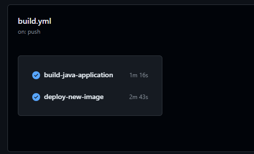
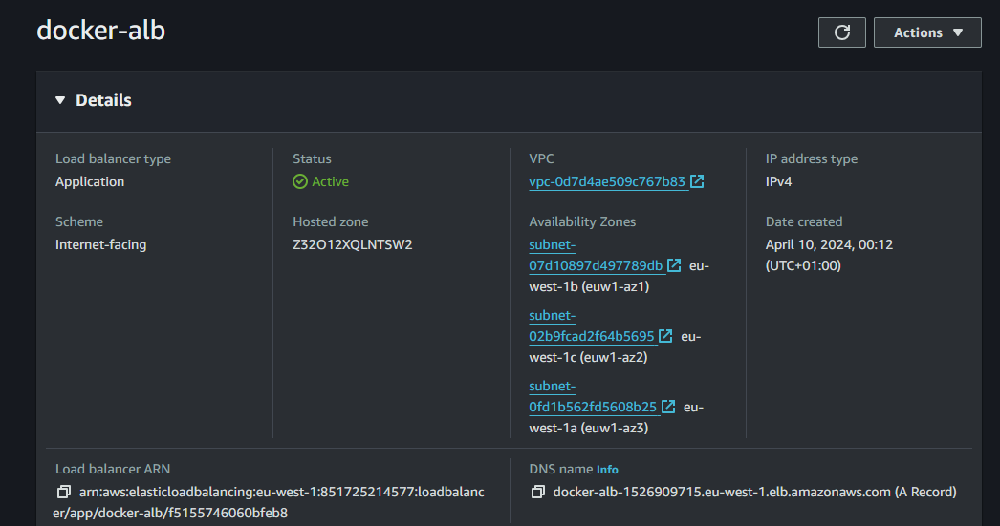
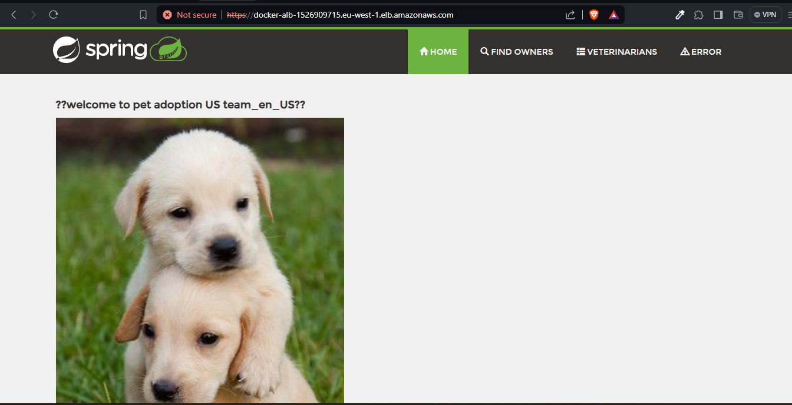
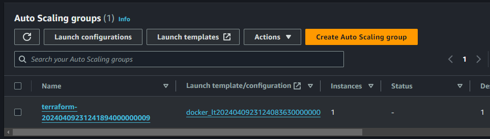

# DevOps Demo Project

In this project, I deployed a web application that is written in JAVA on AWS. When deploying this project, I keep note of key concepts in DevOps such as Autoscaling, Containerization, High Availability, CICD, and Infrasctructure as Code.

In this project, the Instances are spanned across three different availability zones that provides the infra with High availability. 

## Infrastructure
The AWS infrasctruture comprises of AWS services below:
- VPC
- Private Subnets (3)
- Public Subnets (3)
- Route Tables (Public, Private, Default)
- Internet Gateway (1)
- NAT Gateway (1)
- Autoscaling Group
- Launch Template
- EC2
- Security Groups
- Dockerhub
- eu-west-2 region

 All resources packaged and deployed using terraform. In this project, the state file is stored in an s3 bucket `ay-cloud-height-tf-bucket-state`. Most of the resources made use of terraform modules provided by AWS from the terraform documentation.

 ## Autoscaling
 The project contains autoscaling that is configured to monitor cloudwatch metrics for the EC2 instances that will be provisioned. The autoscaling group contains an autoscaling policy that checks if the CPU utilization exceeds 70%. if the previous is true, new instance will be provisioned automatically. And in this instance, it contains a `user_data` that provisions docker and spins up the application.

 ## CICD
 The cicd pipeline for the app is built using GitHub actions, for the CI part, the CI pipeline takes the code base, build the image and push to a Dockerhub image registry. It tags it using the Github commit SHA and also keeps a copy of it in the latest tag.

 The CD pipeline takes up the github commit SHA and updates the image tag that is in the lauch template with the aid of the linux sed command. Using the github commit SHA as image tag helps when it comes to reverting back to a previous deployment. This whole process happens upon change in the github repo.

 ## Replicate App

 To replicate this application, fork this repo on your github account and head over to settings > secrets & environemnt variables > Actions
  Add the following secrets based on naming conventions

  - AWS_ACCESS_KEY_ID
  - SECRET_ACCESS_KEY
  - DOCKER_USERNAME
  - DOCKER_PASSWORD

    Also note that you have to update the image name and tag in `line 36` of the github actions yml file. Naming convention used `<username>/<image_name>`

Make a Change in Any file, commit and push those changes. It will trigger the pipeline to deploy the infra on the cloud.

## Clean Ups

To destroy the configuration, a github actions workflow named `Destroy Terraform Infra` can be triggered using workflow dispatch or manual click to remove all configurations

## Screenshots

Image build and push to dockerhub successful

